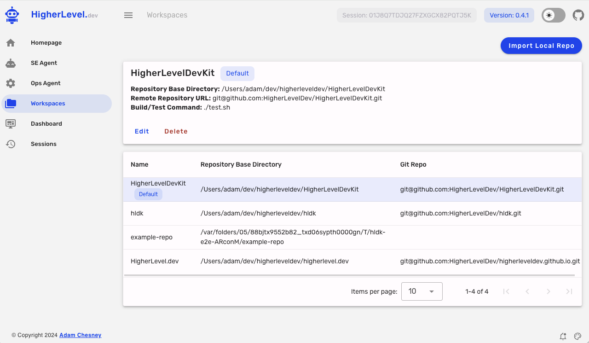
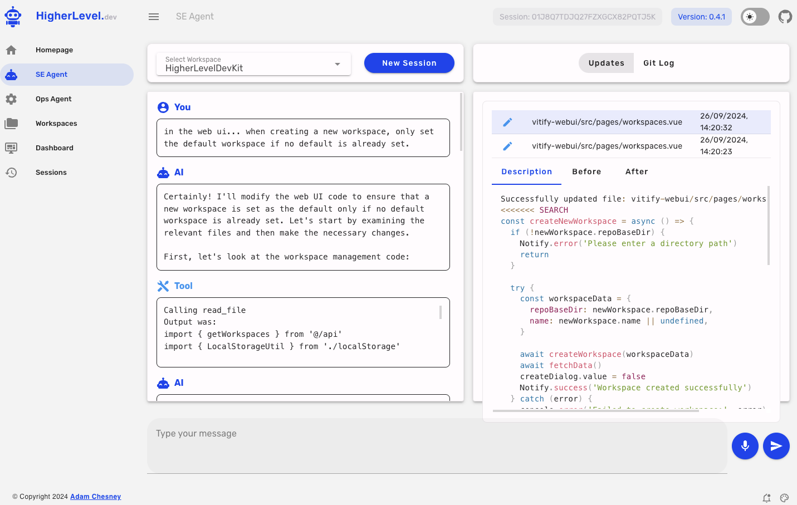
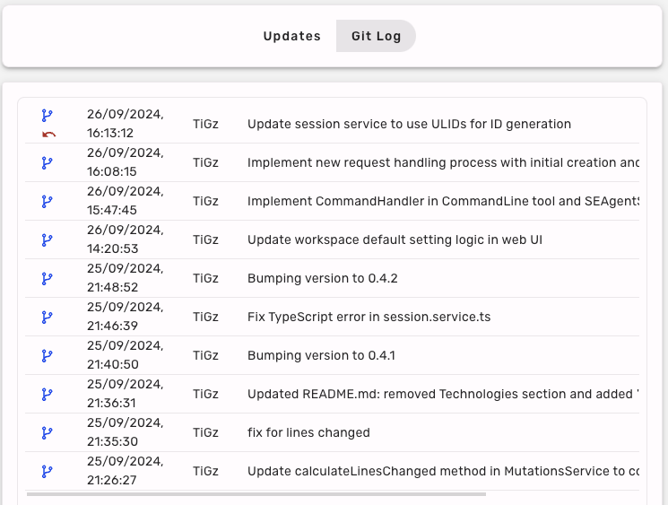
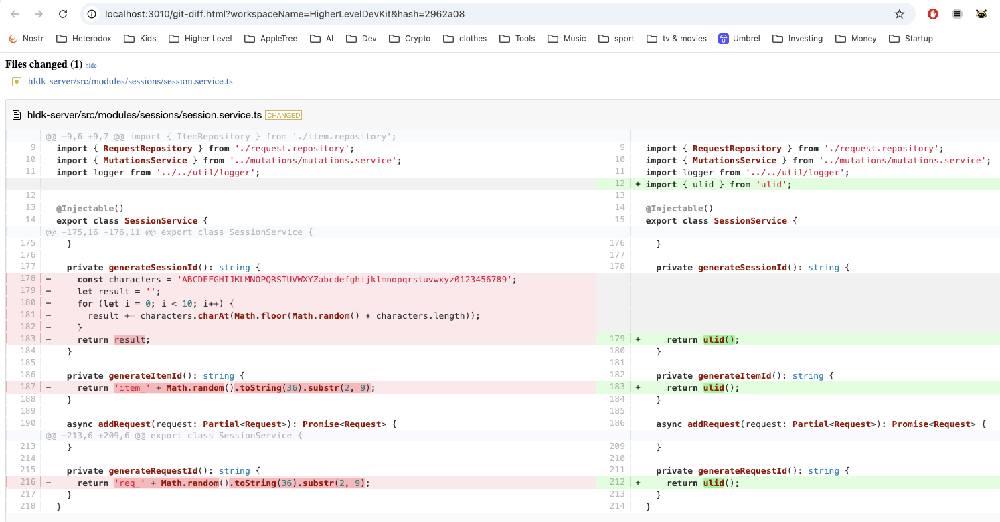
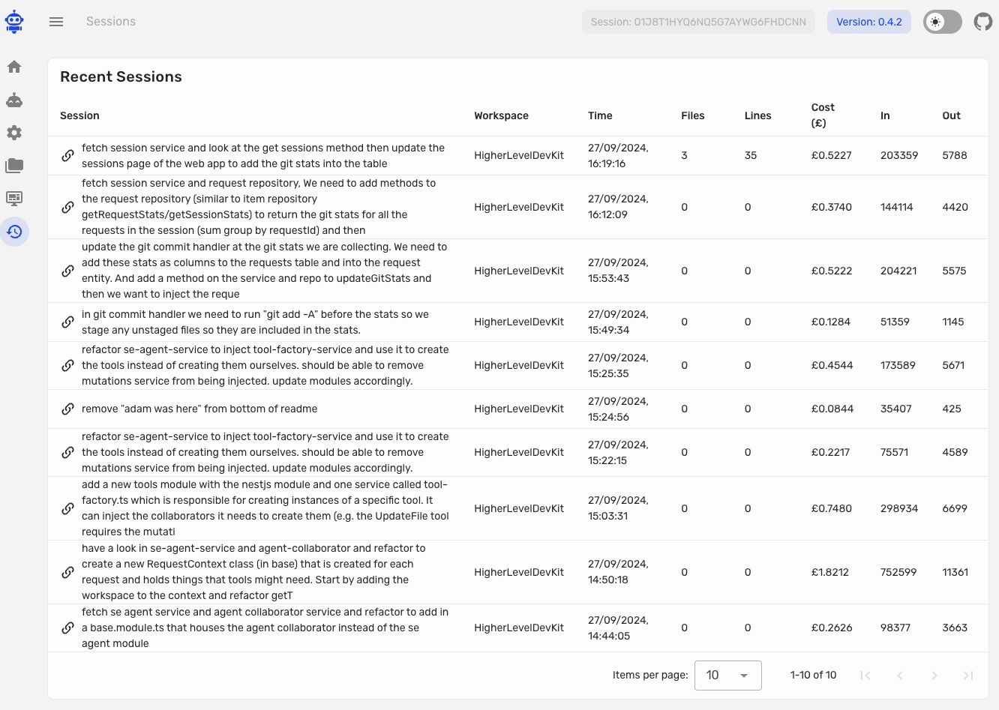

<p align="center">
  
</p>
<h1 align="center">Higher Level Dev Kit</h1>

<p align='center'>
<b>Take command of your own set of Software Engineering Agents</b><br><br>
</p>

## Summary of the Dev Kit

The Higher Level Dev Kit (HLDK) is a powerful tool that allows you to develop software at a higher level using natural language. It offloads the actual coding to an LLM-powered Software Engineering Agent.

Key Features:
* Node-based server and easy to use web UI
* Supports Anthropic Claude Sonnet 3.5 (and also OpenAI & Ollama)
* Works with existing code bases or a clean slate
* Audio transcription support (talk instead of type)
* Workspace management for multiple projects
* Git integration for version control
* Automatically runs and fixes tests


## HLDK in Action

https://github.com/user-attachments/assets/0cf9fa95-d0b9-4bac-ae8c-c24d9731bed0

## Quick Start

1. Clone the repository
2. Verify and install required tools (Node.js 21+ and pnpm)
3. (Optional) Set up audio transcription
4. Run the HLDK server with ./hldk.sh
5. Access the web UI in your browser at http://localhost:3010
6. Get your free API Key from here: https://higherlevel.dev/app
7. Get a Claude API Key from https://console.anthropic.com and enter it into the config page
8. Import your local git repo as a workspace 
9. Chat with the SE Agent to make updates to your system

For detailed instructions, see the sections below.

If you have questions then feel free to email: adam@higherleveldev.com

Or better yet, [join the slack here](https://join.slack.com/t/higherleveldevgroup/shared_invite/zt-2qsik2mti-Y8y_VjO2GFvVqBI_H~JeEA).

## Higher Level Dev Guide

We are creating a guide to help you transition to the world of higher level development.

The guide covers (or will cover!) topics such as:

1. Introduction to Higher Level Development
2. How the AI Software Engineering Agent works
3. Best Practices to get the most out of HLDK
4. Advanced Usage
5. Troubleshooting

To access the guide, please open the [index page](guide/index.md) in the `guide` directory. This living document will be updated regularly with new information and examples to help you make the most of the HLDK system.

**NOTE that the guide is a work in progress and is not complete yet....**

## Getting Started

### A note about Anthropic credits and paying for Claude

You will need to add a debit or credit card and purchase some credits.
A developer working flat out most days is going to rack up something like £100 worth of tokens per month.
YMMV based on repo size etc. You can set limits in the Anthropic Console to protect yourself. 
I suggest you have your own Anthropic account and either expense it or use a company debit/credit card.
If you try to share an API key among developers then you may well run into per month usage limits or rate limits. 

### Install Required Tools

To run the Higher Level Dev Kit, you need to have Node.js (version 21 or higher) and pnpm installed on your system. If you don't have these tools installed, follow these steps:

1. Install Node.js:
   - Visit the official Node.js website: https://nodejs.org/
   - Download and install the latest LTS version (21.x or higher)

2. Install pnpm:
   - After installing Node.js, open a terminal or command prompt
   - Run the following command to install pnpm globally:
     ```
     npm install -g pnpm
     ```

For more information on installing and using pnpm, visit: https://pnpm.io/installation

Once you have Node.js and pnpm installed, you can proceed with the setup of the Higher Level Dev Kit.

### Audio Transcription Setup

The Higher Level Dev Kit includes support for audio transcription (talk into the mic instead of typing) using the faster-whisper library. To set up the audio transcription feature, follow these steps:

1. Make sure you have Python3 and pip installed on your system. If not, the installation script will attempt to install them for you.

2. Run the install-faster-whisper.sh script:

   ```
   ./scripts/install-faster-whisper.sh
   ```

   This script will:
   - Check if Python3 and pip are installed, and install them if necessary.
   - Install the faster-whisper-cli package using pip.

3. After running the script, the faster-whisper-cli should be installed and ready to use with the Higher Level Dev Kit.

Note: The installation script supports macOS and Linux. For Windows users, you may need to install Python3, pip, and faster-whisper-cli manually.

If you encounter any issues during the installation, please refer to the error messages in the console or seek assistance from the project maintainers.

## Running the HLDK Server

Once you have completed the setup steps above, you can start the HLDK server using the provided script. Follow these steps:

1. Open a terminal and navigate to the root directory of the HLDK project.

2. Run the following command:

   ```
   ./hldk.sh
   ```

   This script will:
   - Install or update npm packages using pnpm
   - Start the HLDK server

3. Wait for the server to start. You should see a message indicating that the server is running.

4. Once the server is running, you can access the web UI by opening a web browser and navigating to: http://localhost:3010

If you encounter any issues while starting the server, check the console output for error messages. Make sure you have completed all the setup steps, including setting your Anthropic API key in the `.env` file and installing the required tools.

To stop the server, you can use `Ctrl+C` in the terminal where the server is running.


## Workspaces





### Import a Local Repo
Before you can start developing in tandem with the SE Agent you will need to configure a workspace. To do this select **Workspaces**
from the left hand menu and then **Import Local Repo** where you will be asked for the full path to the git repo. It will take the dir name
to be the name of the workspace unless you choose to override by providing a specific name for your repo.

### Default Workspace
The first Workspace that you set up will be your default workspace and will appear at the top of the drop down on the SE Agent page.
If you want to select a different workspace as your default then you can do that from the Workspaces page by selecting the workspace
in the table and hitting **Set as Default**

### Build/Test Command
You can set a command or script for the SE Agent to run after it makes its code changes but before committing them to git. 
Just hit **Edit** with the workspace selected and enter the command. Note that the Agent may not always run the command automatically
and if it doesn't then a simple "test" prompt should suffice. The Agent should iterate and keep trying to fix stuff
until the tests pass.

## Software Engineering Agent




### Sessions
Create a new session for each new mini-spec that you want to send to the agent. 
If you try to do too much on one session then the agent may get confused. Also be sure to select the correct Workspace or the agent will
definitely get confused!

If you want to make tweaks to the code that was just generated then that is usually fine to do in the same session.

### Chatting with the agent

Send specs or commands by filling out the text area at the bottom that says _"Type your message"_ and then clicking the Send or simply hitting **Enter**.

If you want a new line you can use **Shift+Enter**

The agent can see all the files in the git repo but it may need hints as to where to look for things.

You can say things like: 

* _"Update the session page in the web ui to do x, y, z..."_
* _"Look at mutation service and repo and make changes to do x,y,z..."_
* _"Use the person module as an example and implement a new module called Foo with props (x,y,z) - implement the repo, service, controller with unit tests for all"_

### Voice Transcription


If you want to provide your specs via voice then make sure you have installed the faster whisper cli (see above) and then
just **HOLD** the mic button down... once the mic button turns red then it is listening and will continue to listen until you let
go of the button at which point the recording is streamed to the server and then to faster whisper and the resulting text
will appear in the text area. You will then still need to submit this text by pressing **Enter** or clicking the send button.

### Aborting

If the agent seems to be going awry then you can interrupt what it is doing by hitting the red stop button.

### Updates

During the process of making code updates the SE Agent will update some source files by using its Search & Replace
file update tool. Each operation with this tool results in an entry to the Updates panel on the right. You may see multiple
updates for a single file and that is normal because in large files the agent will not want to have to update the whole file
at once (lots of expensive output tokens) and so it uses multiple Search & Replace edits (find the search text in the file and replace it with the replace text)
to more efficiently update multiple bits.

In the Update panel you have the choice of viewing the Description which shows the Search & Replace block that the agent has
generated to make the edit or either the Before or After panels which show the full file contents immediately before or after
the edit. You can double-click on the Before or After text to copy the file contents to the clipboard in case that's useful.

### Git Log



As an alternative to the Updates panel you can switch to see the Git Log which shows the last 10 or so commits.

You can choose to revert the last commit by clicking on the little red revert icon.

Or you can choose to open a new browser tab to see the unified Git diff for the commit by clicking on the blue git icon.



## Sessions Page



If you need to go back to a previous session then you should be able to find it on the recent sessions page along
with some stats about each session. You can click on the link to take you back to the SE Agent with that session loaded.

Please note that you may not be able to continue with the session if the server has been restarted recently.
This is because the Snapshotting of session data (for Langgraph) is currently only persisted to RAM and not disk.

## Use a Hints file

The SE Agent will always look for a file called **hints.md** in the root of the git repo and the contents are passed on
to Claude. You should add one to your repo and let the agent know about any helpful hints for adding code to the repo.

It should contain things like:

* How you want your code laid out (if it's not already obvious from the existing code)
* Maybe what package manager you are using (if it's not obvious from the file tree)
* Point to good examples of things (e.g. services, entities etc) to look at when adding a new one of those
* Tips about architecture or performance stuff

Here is an example from the HigherLevelDevKit itself:

<pre>
   # These are hints for HLDK or any other AI agent to help it understand the codebase.
   
   # DATABASE CHANGES
   
   When making changes to the database schema you need to add a new knex migration script (.js not .ts!) to the `/migrations` directory
   
   Remember:
   - Use pnpm for all package management calls and NOT npm or yarn.
   - IMPORTANT: Never run pnpm in the root directory
   - For server packages changes you will need to run 'cd hldk-server && pnpm add <package-name>'
   - For client packages changes you will need to run 'cd vitify-webui && pnpm add <package-name>'
   - For ID generation always use ulid - we have already added the ulid package to the project.
   - When generating db related code always try to minimise the number of db round trips - so use group by and in clauses where possible etc.
</pre>


